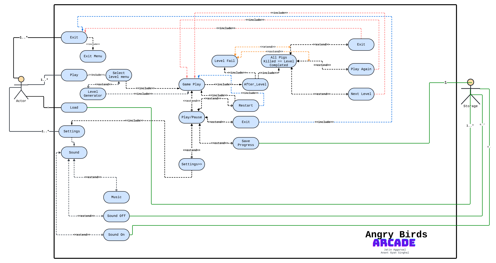

# Angry Birds
___
Angry Birds is a popular puzzle video game. It has a simple story: the pigs stole the birds’ eggs, so the birds try
to get them back. In every level, the player uses a slingshot to launch the birds at the pigs that are standing on
buildings made of blocks. Each level gives the player a line of birds; the bird sitting on the slingshot is launched
when the player pulls the bird back. The bird behind it jumps up, and it is the next bird to be launched.
When a bird is launched, it can hit the buildings and make the blocks break. This can make the pigs fall
and disappear. The bird can also hit the pig itself to destroy it. The player has to destroy all the pigs in the
map to unlock another level.

## Content
___
1. [Classes](#classes)
2. [Use Case](#use-case)
3. [UML](#UML)
4. [Learning Sources](#Leaning-Resources)
5. [Assets](#Assets)
6. [How to Run](#how-to-run)
7. [Github Link](#Github-Link)

## Classes
___
1. ### Bird
   Interface for various type of birds.
2. ### BlackBird
   Helps in drawing black bird with and without slingshot
3. ### BlueBird
   Helps in drawing blue bird with and without slingshot
4. ### RedBird
   Helps in drawing red bird with and without slingshot
5. ### YellowBird
   Helps in drawing yellow bird with and without slingshot
6. ### Materials
   Interface for various types of materials
7. ### Log
   Helps in drawing log
8. ### Box
   Helps in drawing box
9. ### ExitPage
   Helps to set exit page to the game screen
10. ### Pig
    Helps to draw pig on screen
11. ### KingPig
    Helps to draw a big pig on screen
12. ### LevelFailed
    Helps to set level failed on screen when no bird is left
13. ### Levelone
    Help to play level one on screen
14. ### LevelPassed
    Helps to set level passed on screen when no bird is left
15. ### LevelScreen
    Helps in setting game screen to the screen to choose levels
16. ### LevelStructure
    Helps in setting up the blocks of the level
17. ### Leveltwo
    Help to play level two on screen
18. ### Levelthree
    Help to play level three on screen
19. ### LoadingScreen
    Helps to load the login screen with loading bar
20. ### Login
    Login Screen
21. ### Login_or_signup
    Screen to ask user for login or signup
22. ### Main
    Helps in running the program
23. ### MenuScreen
    Helps in setting the screen to play the game
24. ### PauseScreen
    Helps in pausing the game in between
25. ### SavingPage
    Helps in setting the page to save data
26. ### SettingPage
    Helps to set the screen to setting page
27. ### Signup
    Helps in signup
28. ### VerticalLog
    Helps in drawing vertical log

## Use Case
___

## UML
___

## Learning Resources
___
1. https://libgdx.com/dev/
2. https://libgdx.com/wiki/
3. https://github.com/libgdx/libgdx
4. https://www.youtube.com/watch?v=YCGmXVCvogY&list=PLrnO5Pu2zAHKAIjRtTLAXtZKMSA6JWnmf&ab_channel=HollowBit

## Assets
___
1. https://angrybirds.fandom.com/wiki/Angry_Birds_Wiki
2. https://www.vecteezy.com/free-vector/angry-birds-game
3. https://angrybirdsfanon.fandom.com/wiki/Angry_Birds_Survival?file=71AB7876-462E-419B-B06C-711C6EFCBC35.png
4. https://travisruiz.tumblr.com/post/144657042173/the-angry-bird-movie-world-premiere-a-little
5. https://www.deviantart.com/camarasketch/art/Naboo-Grass-Plains-430336300
6. https://in.pinterest.com/pin/angry-birds-toons-backgrounds-on-behance--269371621454537528/

## How to run
___
- Unzip the file. 
- Go to lwjgl3. 
- Then src. 
- Then main. 
- Then java. 
- Then com.AngryBirds.lwjgl3. 
- Then Lwjgl3Launcher. 
- Then click on Run.

## Github Link
____
https://github.com/heckerm4n/Angry-Birds

## Creators
___
- Jatin Aggarwal ( 2023258 )
- Anant Gyan Singhal ( 2023082 )
